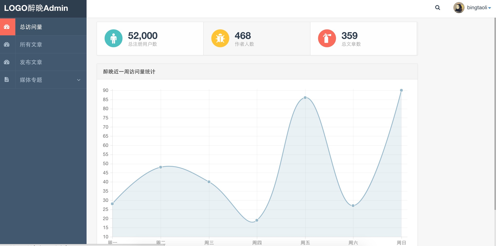
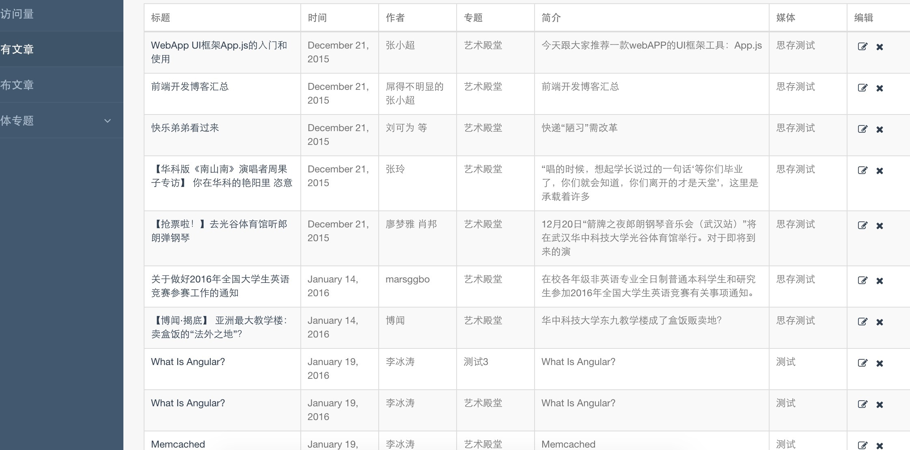

醉晚后台管理界面.

### 运行

```
// cd into your webroot 
git clone https://github.com/bingtaoli/zuiwan-backend.git
npm install
bower install
```

浏览器访问就好了.

### 简介

醉晚网站是一个华科校内信息整合发布平台，我们会提供优质的文章及新闻，它们来自华科的优质公众号，所以，希望大家关注！

前端是: [zuiwan-frontend](https://github.com/husterxsp/zuiwan-frontend)

后台数据是: [zuiwan-backend](https://github.com/bingtaoli/zuiwan-backend)

该仓库为后台管理界面。

### 管理界面

首先感谢notebook软件的设计，因为这里借鉴了太多。

数据统计:



文章管理: 



### todo

- [ ] 数据统计， 尚未实现，后续
- [ ] 搜索引擎的使用，计划使用coreseek，实现对mysql数据源的搜索
- [ ] 登陆
- [ ] ...